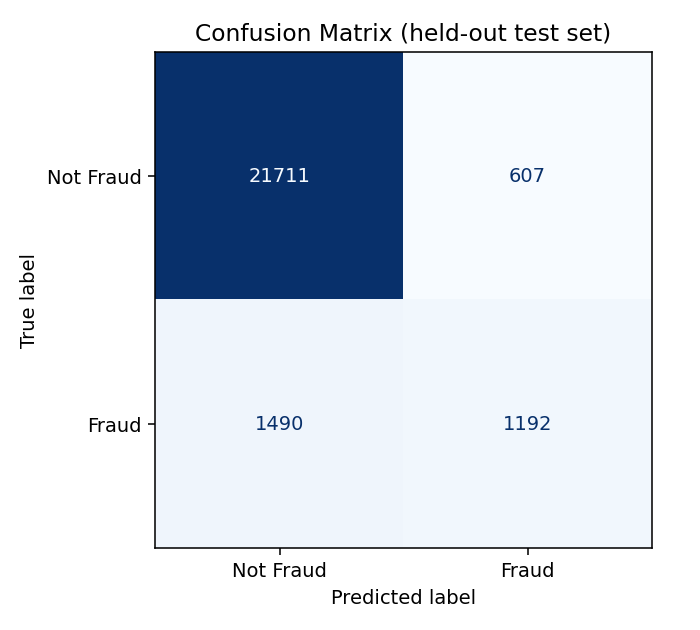
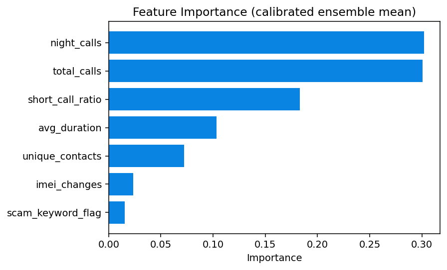

# 📞 Phone Fraud Detection System

A Flask web app that flags likely fraudulent phone numbers from call-behavior
data, using a calibrated Random Forest classifier trained on call patterns
(night calls, short-call ratio, IMEI changes, scam keyword flags, etc).

**🔴 Live demo:** https://aadithyaraja1234.pythonanywhere.com/

Upload a CSV of phone numbers and their call statistics; the app returns a
Fraud / Not Fraud prediction with a confidence score for every row.

---

## How it works

1. You upload a CSV (see [CSV format](#csv-format) below).
2. The app selects the seven feature columns the model was trained on
   (ignoring any extra columns like a `number` identifier or label columns
   such as `is_fraud`), scales them with the fitted `StandardScaler`, and
   runs them through the trained classifier.
3. Results are rendered as a table: prediction (Fraud / Not Fraud) and a
   confidence percentage, alongside the original row data.

## Model

- **Algorithm:** `RandomForestClassifier` (300 trees, max depth 8,
  `class_weight="balanced_subsample"`) wrapped in a
  `CalibratedClassifierCV` (sigmoid calibration, 5-fold) so confidence
  scores are meaningfully close to true probabilities rather than
  overconfident 99%/1% spikes.
- **Trained on:** [`fraud_dataset.csv`](fraud_dataset.csv) — 100,000
  synthetic rows generated by [`generate_dataset.py`](generate_dataset.py),
  ~10.7% labeled fraud (see [Limitations](#limitations--data-honesty) for
  how the synthetic labels are constructed and why that matters).
- **Features used:**

  | Feature | Meaning |
  |---|---|
  | `total_calls` | Total number of calls made |
  | `avg_duration` | Average call duration (minutes) |
  | `night_calls` | Number of calls made at night |
  | `unique_contacts` | Number of distinct numbers contacted |
  | `imei_changes` | Number of times the device's IMEI changed |
  | `scam_keyword_flag` | Whether scam-related keywords were detected (0/1) |
  | `short_call_ratio` | Fraction of calls that were unusually short |

### Held-out performance

Evaluated on a stratified 25% held-out split (25,000 rows) of
`fraud_dataset.csv`, which is imbalanced (~10.7% fraud) — so accuracy
alone is a weak signal here and precision/recall/AUC matter more:

| Metric | Value |
|---|---|
| Accuracy | **91.6%** |
| ROC AUC | **0.834** |

| Class | Precision | Recall | F1-score | Support |
|---|---|---|---|---|
| Not Fraud | 0.936 | 0.973 | 0.954 | 22,318 |
| Fraud | 0.663 | 0.444 | 0.532 | 2,682 |



The model is tuned (`class_weight="balanced_subsample"`) to lean toward
catching fraud rather than maximizing overall accuracy: it recalls ~44%
of actual fraud cases, at the cost of a fair number of false positives
(precision 0.66). That precision/recall trade-off — not a single
accuracy number — is the honest way to read this model's usefulness; see
[Limitations](#limitations--data-honesty) for why recall isn't higher.

Feature importance (mean across the calibrated ensemble):



`night_calls` and `total_calls` dominate, followed by `short_call_ratio`
and `avg_duration` — together over 80% of the model's decision weight.
`scam_keyword_flag` and `imei_changes` contribute the least, since they're
the features most damped by the "evasiveness" factor in the data
generator (see below).

## Limitations & data honesty

This is a **synthetic dataset**, and its design choices matter for how
much weight to put on the metrics above:

- **No real fraud data.** `fraud_dataset.csv` is generated by
  [`generate_dataset.py`](generate_dataset.py), not sourced from an actual
  telecom fraud dataset (which would be sensitive/proprietary and isn't
  publicly available). Real-world call patterns almost certainly have
  correlations, edge cases, and adversarial behavior this generator
  doesn't capture.
- **The label depends on a hidden latent factor, not a direct formula
  over the visible features.** An earlier version of this generator
  computed `is_fraud` directly from a weighted formula over the same 7
  columns the model is trained on — which meant a model could hit ~96%
  accuracy by simply re-deriving that formula, which is not evidence of
  learning generalizable fraud signals. The current generator instead
  draws a hidden `latent_risk` value per row (never written to the CSV),
  and the 7 visible features are only noisy, partially-informative
  proxies of it — further dampened by a hidden "evasiveness" factor
  (sophisticated fraud disguises itself better) and 3% random label
  noise (real fraud labels, from complaints and investigations, are
  never perfectly clean either). This is why recall tops out around 44%
  instead of 94% — some fraud in this dataset is, by design, not
  recoverable from the visible features, the same way real fraud
  detection has an irreducible error floor.
- **Class imbalance is a deliberate but still simplified choice.** ~10.7%
  fraud is more realistic than a coin-flip split, but real-world fraud
  rates in telecom are typically far lower (well under 1%), which would
  push precision down further for the same recall.
- **Take the specific numbers as illustrative, not a claim of
  production-readiness.** The point of this project is to demonstrate an
  end-to-end pipeline (synthetic data generation → training → calibration
  → deployment) and honest evaluation practice, not a benchmark result
  ready to deploy against real telecom traffic.

## CSV format

At minimum, your CSV needs the seven feature columns above. Extra columns
(a `number` identifier, or label columns like `is_fraud` from a sample
dataset) are fine — the app ignores anything it doesn't need.

```csv
number,total_calls,avg_duration,night_calls,unique_contacts,imei_changes,scam_keyword_flag,short_call_ratio
9990001111,70,8,10,90,0,0,0.12
```

Sample files [`test1.csv`](test1.csv), [`test2.csv`](test2.csv), and
[`test3.csv`](test3.csv) are included for quick testing.

## Project structure

```
app.py                   Flask app (routes: / and /predict)
train_model.py            Trains the model from fraud_dataset.csv
generate_dataset.py       Generates the synthetic fraud_dataset.csv
fraud_model.pkl            Trained CalibratedClassifierCV (loaded by app.py)
scaler.pkl                 Fitted StandardScaler (loaded by app.py)
templates/
  index.html                Upload form
  result.html                Results table
docs/
  confusion_matrix.png       Held-out confusion matrix (see README)
  feature_importance.png     Feature importance chart (see README)
requirements.txt           Runtime dependencies for app.py
DEPLOY.md                  Step-by-step PythonAnywhere deployment guide
```

## Running locally

```bash
git clone https://github.com/aadithyaraja1234-cmyk/phone_fraud_detection.git
cd phone_fraud_detection
python -m venv venv
venv\Scripts\activate        # Windows; use `source venv/bin/activate` on macOS/Linux
pip install -r requirements.txt
python app.py
```

Then open http://127.0.0.1:5000 and upload a CSV.

By default the dev server runs with debug mode **off** (safe default). For
local development with auto-reload and the interactive debugger, set
`FLASK_DEBUG=1` before running — never do this on a public deployment (see
[app.py](app.py) for why).

## Retraining the model

```bash
python generate_dataset.py   # regenerates fraud_dataset.csv (optional)
python train_model.py        # retrains and overwrites fraud_model.pkl + scaler.pkl
```

## Deployment

The live demo runs continuously (free tier, no cold starts) on
PythonAnywhere. See [`DEPLOY.md`](DEPLOY.md) for the full step-by-step
setup guide, including a ready-to-paste WSGI config and troubleshooting
notes for PythonAnywhere's free-tier disk quota.

## Tech stack

Flask · scikit-learn · pandas · NumPy · joblib
